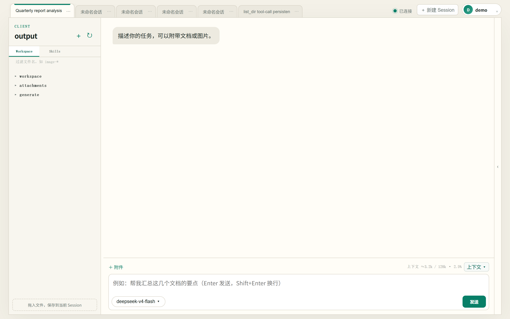
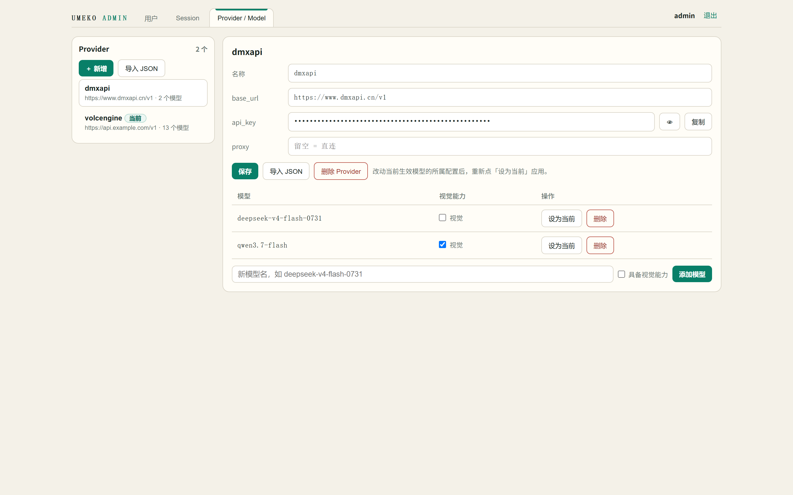

<div align="center">

# UMEKO

**Unified Multi-agent Execution Kernel & Orchestrator**

*统一多智能体执行内核与编排器*

[](https://github.com/umeiko/UmEkO/actions/workflows/ci.yml)
[](https://github.com/umeiko/UmEkO/releases)
[](https://www.python.org)
[](LICENSE)

**English** | [简体中文](#中文)

</div>

---

A domain-agnostic **general-purpose Agent platform**: chat with files, delegate sub-tasks, manage models and users — deployable as a cloud service or a local single-exe server.

一个领域无关的**通用 Agent 平台**：对话式处理文件、派发子任务、管理模型与用户——既可做云服务，也能以单文件 exe 本地部署。

|  |  |
|:---:|:---:|
| WebUI — Workspace & tool calls / 工作台与工具调用 | Admin console / 管理控制台 |

## Highlights ✨ / 特性

- 🖥 **WebUI** — streaming chat, tool-call inspector (live streaming output), file tree with filter, workspace preview, 7 languages / 流式对话、工具调用实时检视、文件树过滤、7 种界面语言
- 🤖 **Two-tier agents** — main agent + sandboxed file sub-agent (`delegate_task`), sub-agent context is destroyed after reporting / 主 Agent + 受限文件子 Agent，汇报后上下文即毁
- 👁 **Vision pipeline** — `image_reasoning` streams vision-model output into the tool card in real time / 视觉模型输出实时流进工具卡片
- 🗂 **Provider registry** — multi-provider / multi-model management, vision flags, JSON import, one-click activation / 多供应商多模型、视觉标记、JSON 导入、一键切换
- 👥 **Admin console** — user & session management, config hot-reload with instant eviction / 用户与 Session 管理、配置热更新即时生效
- 📦 **File ops** — read/grep/edit/write with sandbox, archive extraction (7-Zip), large-file guards / 沙箱文件操作、压缩包解压、大文件兜底
- 💾 **Durable history** — tool calls & attachment mappings persisted in SQLite / 工具调用与附件映射 SQLite 持久化
- ⚡ **Cancellation & streaming** — cooperative cancel, SSE everywhere / 协作式取消、全链路 SSE

## Quick Start 🚀 / 快速开始

### Download exe（Windows）

Grab `umeko-server.exe` from [Releases](https://github.com/umeiko/UmEkO/releases), put a `.env` next to it:

从 [Releases](https://github.com/umeiko/UmEkO/releases) 下载 `umeko-server.exe`，在同目录放一个 `.env`：

```ini
TEXT_MODEL_NAME=your-model
TEXT_MODEL_BASE_URL=https://api.example.com/v1
TEXT_MODEL_API_KEY=sk-xxx
# Optional 可选：
# VISION_MODEL_NAME=qwen-vl       # enables image_reasoning 启用视觉分析
# VISION_MODEL_API_KEY=sk-xxx
# VISION_MODEL_BASE_URL=https://api.example.com/v1
```

```bash
umeko-server.exe --port 8000          # WebUI  http://127.0.0.1:8000
                                      # Admin  http://127.0.0.1:9000  (first boot prints bootstrap hint / 首次启动打印管理员引导)
```

### From source / 源码运行

```bash
git clone https://github.com/umeiko/UmEkO.git
cd UmEkO
uv sync                                   # or: pip install -e .
cp .env.example .env                      # fill in your model keys 填入模型配置
uv run python -m umeko.server --port 8000 # cloud mode 云模式（8000 + admin 9000）
uv run python -m umeko.local  --port 8765 # local mode 本地模式（免登录）
```

## Architecture 🏗 / 架构

```
┌────────────────────────── Delivery 交付层 (L3) ──────────────────────────┐
│  server/ (FastAPI + WebUI + admin)   local.py (no-auth)   cli.py (REPL)  │
├────────────────────────── Host 宿主服务 (L2) ─────────────────────────────┤
│  service.py (sessions/runs/config)  storage.py (SQLite)  profile.py      │
├────────────────────────── Runtime 运行时 (L1) ────────────────────────────┤
│  agent.py (main loop)  sub_agent.py  runner.py (Run lifecycle)  events.py│
├────────────────────────── Kernel 内核件 (L0) ─────────────────────────────┤
│  llm/ (OpenAI-compat, streaming)  skills/ (file tools)  cancellation.py  │
└──────────────────────────────────────────────────────────────────────────┘
```

One event channel (`events.py`) feeds every delivery surface — Web, CLI and future IDE clients see the same stream. / 单一事件通道，Web、CLI 与未来 IDE 客户端共享同一事件流。详见 [ARCHITECTURE.md](ARCHITECTURE.md)。

## Configuration / 配置

Priority 优先级: **Provider registry 注册表激活模型 > DB overrides > .env**

| Key | Description 说明 |
|---|---|
| `TEXT_MODEL_NAME/BASE_URL/API_KEY` | main model 主模型（必需） |
| `VISION_MODEL_NAME/BASE_URL/API_KEY` | vision model 视觉模型（启用 image_reasoning） |
| `MODEL_PROXY` | proxy for model gateway 模型网关代理 |
| `UMEKO_ADMIN_USERNAME/PASSWORD` | first-boot admin bootstrap 仅首次启动引导管理员 |

## For Developers / 开发者

```bash
uv run pytest              # tests 测试
uv run pyinstaller umeko.spec   # build exe 构建单文件服务端
```

Domain flows (diagram generation, document QC…) inject via `extra_skills` — the kernel stays clean. / 领域流程通过 `extra_skills` 注入，基座保持干净。

---

<div align="center">

[简体中文 ↑](#umeko) · **中文** | [English](#english)

# 中文

</div>

一个领域无关的通用 Agent 基座：多模型管理、双 Agent 协作、Web 管理面，一键打包为单文件 exe。

|  |  |
|:---:|:---:|
| 工作台：流式对话 + 工具调用实时检视 + 文件树 | 管理控制台：用户 / Session / 供应商注册表 |

## 特性

- **WebUI**：流式对话、工具调用详情（执行中实时滚动输出）、文件树过滤、图片/CSV/Markdown 预览、7 种语言
- **双 Agent**：主 Agent + 文件子 Agent（`delegate_task`），子 Agent 上下文汇报后销毁，保护主上下文
- **视觉管线**：`image_reasoning` 按任意 prompt 分析图片（写「提取全部文字」即 OCR），输出实时流进工具卡片
- **供应商注册表**：多 Provider 多模型、视觉能力标记、粘贴 JSON 批量导入、一键切换并全员生效
- **管理面**：独立端口（默认 9000）、用户/Session 管理、配置热更新即时驱逐
- **文件工具**：沙箱读写、正则/grep 搜索、目录树（单目录 50 项折叠 + 整树上限）、7-Zip 解压
- **持久化**：工具调用历史、附件映射、配置覆盖层全部 SQLite 落盘
- **取消与流式**：协作式取消、全链路 SSE

## 快速开始

见上文 [Quick Start](#quick-start--快速开始)——exe 与源码两种方式，`.env` 只需三个模型键。

## 架构

四层：L0 内核件（LLM 客户端/文件工具/取消）→ L1 运行时（主循环/子 Agent/Run 生命周期/事件协议）→ L2 宿主服务（Session/SQLite/Profile 双场景开关）→ L3 交付层（server/local/cli）。云模式与本地模式只差三个 Profile 开关。详见 [ARCHITECTURE.md](ARCHITECTURE.md)。

## 配置优先级

**注册表激活模型 > DB 覆盖键 > .env**；配置变更立即驱逐所有在线 Session。管理员在 9000 端口的「Provider / Model」页维护注册表。

## 开发

```bash
uv run pytest                      # 24 个测试
uv run pyinstaller umeko.spec      # 出 umeko-server.exe
```

领域流程（作图、文档质检……）不进基座：以 `extra_skills` 注入即可。
