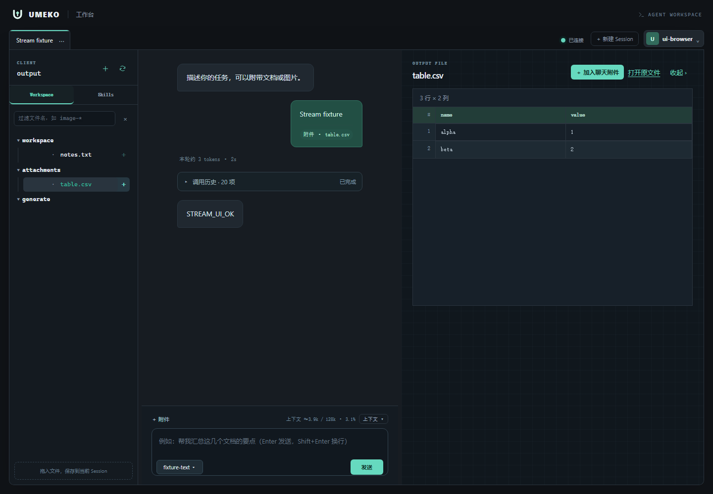
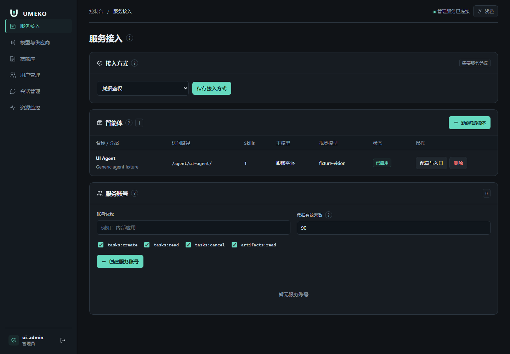

<div align="center">

<picture>
  <source media="(prefers-color-scheme: dark)" srcset="docs/assets/brand/icon-light.svg">
  
</picture>

# UMEKO

**统一多智能体执行内核与编排器**

[](https://github.com/umeiko/UmEkO/actions/workflows/ci.yml)
[](https://github.com/umeiko/UmEkO/releases)
[](https://www.python.org)

[English](README.md) | **简体中文**

</div>

---

UMEKO 是一个用于处理文件的 Python Agent 服务，提供网页工作台、CLI 和 HTTP API，支持模型配置、用户管理和技能包扩展。

**[在线文档站](https://umeiko.github.io/UmEkO/)** · [架构设计](https://umeiko.github.io/UmEkO/architecture/) · [API 文档](https://umeiko.github.io/UmEkO/api/)

|  |  |
|:---:|:---:|
| 工作台与工具调用 | 管理控制台 |

## 功能

- **网页工作台**：流式对话、工具详情与调用历史、文件过滤和预览，支持 7 种界面语言。
- **任务委派**：主 Agent 通过 `delegate_task` 派发文件任务，子 Agent 返回结果后释放上下文。
- **图像分析**：`image_reasoning` 支持图像分析和文字提取，执行进度显示在工具详情中。
- **模型配置**：支持多个 Provider 和模型、视觉能力标记、JSON 导入及每模型并发上限。
- **管理面**：通过独立端口管理用户、会话、模型、技能包、服务凭据，并监控资源和队列。
- **机器接入**：MCP Streamable HTTP 与 A2A 1.0 JSON-RPC，共用有界任务队列、持久化结果、归属隔离和自动过期清理。
- **多智能体管理**：独立配置名字、工作指引、默认模型、默认视觉模型和技能选择，通过 `/agent/{slug}` 提供各自的 Card、MCP、A2A 与 REST 任务入口，共享执行基座和模型队列。
- **文件操作**：在会话目录内读取、搜索、编辑和写入文件，支持 7-Zip 解压及拖拽上传。
- **历史记录**：消息、工具调用和附件映射保存在 SQLite 中。
- **运行控制**：通过 SSE 返回执行输出，支持协作式取消。

## 快速开始

### 下载 exe（Windows）

从 [Releases](https://github.com/umeiko/UmEkO/releases) 下载 `umeko-server.exe`，放到固定目录后运行。

首次启动会初始化管理员账号，并生成部署 `.env` 模板。使用已配置的管理员凭据登录，开始对话前在管理面 Provider / Model 或 CLI 中配置并激活模型。

```ini
UMEKO_DATA_ROOT=server_data
UMEKO_BASE_PATH=
MODEL_CA_FILE=
```

```bash
umeko-server.exe --port 8000          # WebUI  http://127.0.0.1:8000
                                      # 管理面 http://127.0.0.1:9000
```

### 源码运行

```bash
git clone https://github.com/umeiko/UmEkO.git
cd UmEkO
uv sync --extra server                    # 或 python -m pip install -e ".[server]"
uv run python -m umeko.server --port 8000 # 云模式（8000 + 管理面 9000）
uv run python -m umeko.local  --port 8765 # 本地模式（免登录）
```

## 启动与生产部署

完整步骤见 [启动与生产部署指南](docs/deployment.md)：首次配置、源码 / Windows exe 启动、旧配置迁移、NGINX / ALB 前缀、模型 CA、流式验收、数据持久化、备份升级和故障排查。
[文档索引](docs/README.md) 也提供架构说明和本地代理实验入口。

共享生产服务使用 `umeko.server`；`umeko.local` 是个人免登录工作台。模型在 Provider / Model 中配置并激活，固定和持久化 `UMEKO_DATA_ROOT`，管理端口只供受控内网访问，应用使用单个进程。修改 `.env` 部署项后重启。

## 架构

| 层 | 职责 | 源码 |
| --- | --- | --- |
| L3：接口 | 网页、管理面、本地工作台和 CLI | `server/`、`local.py`、`cli.py` |
| L2：宿主服务 | 会话、存储、运行模式和配置 | `host/` |
| L1：运行时 | Agent、Run 生命周期和事件 | `agent.py`、`sub_agent.py`、`runner.py`、`events.py` |
| L0：核心能力 | 模型客户端、工具、技能和取消 | `llm/`、`skills/`、`cancellation.py` |

Web 和 CLI 使用 `events.py` 中的事件定义展示执行进度。当前实现见[架构文档](https://umeiko.github.io/UmEkO/architecture/)。机器接入支持 [MCP](https://umeiko.github.io/UmEkO/api/mcp/) 与 [A2A](https://umeiko.github.io/UmEkO/api/a2a/)，共用[持久化任务与服务凭据](https://umeiko.github.io/UmEkO/api/machine-tasks/)。管理员可在[资源监控](https://umeiko.github.io/UmEkO/api/monitoring/)查看 CPU、内存、磁盘和任务 / 模型队列。

## 技能包

技能包包含 Markdown 提示词，以及可选的参考文档和 Python 脚本。Agent 通过 `read_pack_file` 读取附属文件，通过 `run_skill_script` 执行脚本，支持超时和取消。

管理员在管理面编辑、下发、启用和停用技能包，用户在各自会话中挂载。

## 配置

模型地址、密钥、代理、模型名、视觉能力和并发上限保存在 Provider 注册表（`UMEKO_DATA_ROOT/umeko.db`）。管理面、CLI 和本地工作台共用解析逻辑；`.env` 保存部署配置及运行参数默认值。

| 部署项 | 用途 |
| --- | --- |
| `UMEKO_DATA_ROOT` | 数据及 Provider 注册表目录，默认 `server_data`，需持久化 |
| `UMEKO_BASE_PATH` | 入口路径前缀，如 `/doc-master/consistency/image-text`；本地根路径留空 |
| `MODEL_CA_FILE` | 模型服务额外信任的 PEM CA；仍校验证书和域名 |
| `UMEKO_ADMIN_USERNAME/PASSWORD` | 首次管理员引导 |

复制 `providers.example.json` 为 `providers.local`，填写后也可通过 CLI 配置：

```sh
python -m umeko.cli providers import providers.local
python -m umeko.cli providers list
python -m umeko.cli providers use mdl_这里替换为模型ID
python -m umeko.cli
```

网页下一轮提问读取新模型；CLI 的 `/reload` 读取更新并开始新对话。各入口使用同一数据目录才能共享配置；原本独立的本地安装可用 `--data-root local_data` 保留原数据。
首次升级会一次性迁移旧模型配置，不覆盖已有凭据和激活选择。确认数据目录后，执行 `python -m umeko.cli providers migrate-env --remove` 移除旧 `.env` 模型项。
具体 NGINX 配置、证书和迁移步骤见 [部署说明](docs/deployment.md)，实际验证见 [红帽 Docker 实验](scripts/proxy_lab/README.md)。

## 开发

```bash
uv sync --extra dev              # 安装测试与打包依赖
uv run pytest tests/ -q          # 项目测试
uv run pyinstaller umeko.spec    # 构建单文件服务端 exe
```

作图、文档质检等领域流程通过技能包扩展。
