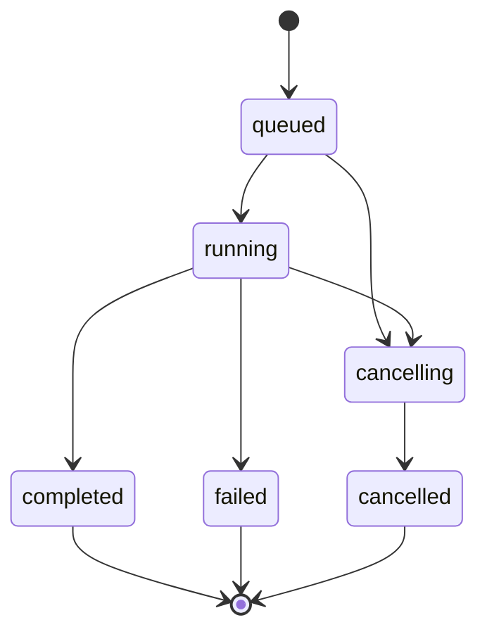

# 会话与运行

Session 保存聊天上下文与文件，Run 是其中一次提问的执行。一个 Session 同时只能有一个活跃 Run，不同 Session 可以并行。

## Session

| 方法 | 路径 | 结果 |
| --- | --- | --- |
| GET | `/v1/sessions` | 当前用户会话列表，当前无分页 |
| POST | `/v1/sessions` | 请求 `{}`，返回 `201 SessionView` |
| GET | `/v1/sessions/{sid}` | `SessionView` |
| PATCH | `/v1/sessions/{sid}/title` | `{"title":"标题"}`，1–80 字符，`204` |
| DELETE | `/v1/sessions/{sid}` | 删除会话和文件，`204` |
| GET | `/v1/sessions/{sid}/messages` | `MessageView[]` |
| GET | `/v1/sessions/{sid}/tool-events` | `ToolEventView[]`，含所属 `run_id` |
| POST | `/v1/sessions/{sid}/clone` | 复制文件、当前上下文、消息与技能挂载，`201` |

这里的 `{sid}` 是表格简写，实际路由参数名为 `session_id`。其他用户的会话按不可见资源返回 `404`。

## 上下文操作

| 方法 | 路径 | 行为 |
| --- | --- | --- |
| GET | `/v1/sessions/{sid}/context` | 占用、消息数与上下文限制 |
| POST | `/v1/sessions/{sid}/context/compact` | 压缩上下文，可能调用模型 |
| POST | `/v1/sessions/{sid}/context/clear` | 清空模型上下文 |
| POST | `/v1/sessions/{sid}/chat/clear` | 清空聊天记录与上下文，保留文件和技能挂载 |

压缩 / 清空上下文返回 `ContextView`，聊天清空返回 `SessionView`。活跃执行冲突返回 `409`。上下文 token 统计可能是估算；看 `exact` 区分口径，不用于供应商计费。

## 创建 Run

`POST /v1/sessions/{sid}/runs`：

```json
{"input": "检查附件", "attachments": ["file_example"]}
```

`input` 至少 1 字符；`attachments` 由[附件接口](files-skills.md)返回。成功返回 `202 RunView`：

```json
{
  "id": "run_example",
  "session_id": "session_example",
  "status": "queued",
  "created_at": "2026-10-08T00:00:00+00:00",
  "completed_at": null,
  "reply": null,
  "error": null
}
```

执行线程可能在响应生成前已经开始，所以最初状态不保证一定是 `queued`。同会话已有运行时，当前创建接口返回 `400`。

## 查询、流式与取消

| 方法 | 路径 | 行为 |
| --- | --- | --- |
| GET | `/v1/runs/{run_id}` | 查询 `RunView` |
| GET | `/v1/sessions/{sid}/active-run` | 活跃 Run 或 `null` |
| GET | `/v1/runs/{run_id}/events` | SSE，详见[事件契约](events.md) |
| POST | `/v1/runs/{run_id}/cancel` | 请求取消，返回当前 `RunView` |



这个图表达正常生命周期；取消是协作式请求，与任务完成可能存在竞态。收到取消响应后继续查询，等 `completed`、`failed` 或 `cancelled` 才确认已结束。断开 SSE 或停止轮询不会发起取消。

Run 和事件只在当前进程内存中。聊天与工具历史持久化不等于运行状态持久化；重启后旧 Run 查询可能 `404`。
