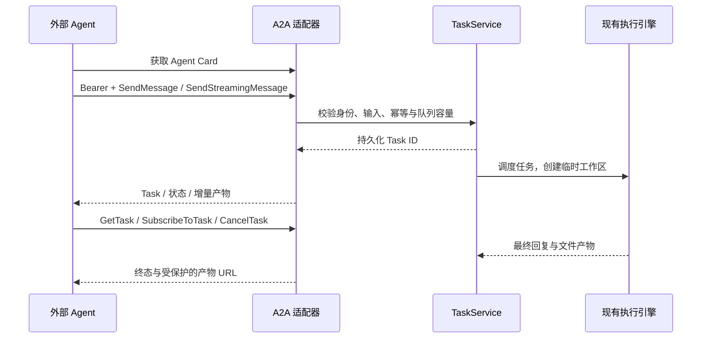

# A2A 接入架构

**已实现 A2A 1.0 JSON-RPC 服务与公开 Agent Card。** 使用官方 `a2a-sdk>=1.2.2,<2` 的 protobuf 类型、路由和客户端，协议请求带 `A2A-Version: 1.0`。

## 当前能力

每个 Agent 的 Card 位于 `/agent/{slug}/.well-known/agent-card.json`，声明该 Agent 的 `/agent/{slug}/a2a` 接口、流式能力、鉴权方式和所选技能。公开 Card 不包含工作指引、服务凭据、Provider Key 或主机文件路径。

Card 由 `AgentCards` 从 `AgentRegistry` 配置生成。管理员在“服务接入”的智能体管理表单维护介绍、工作指引、默认模型与技能选择，保存到 `agent_definitions`。协议能力、地址和鉴权声明由服务生成，JSON 只作预览，没有全局 Card 编辑接口。

技能来源为 `default_skills` 中该 Agent 选择且已启用的数据库副本。Card 只提取文档头部名称和简介；文件名作为稳定 ID，正文、脚本和附属文件不对外发布。新任务使用同一选择并保存主文档快照，没有可用技能时返回空列表。

接入方式统一配置，免凭据请求在同一 Agent 内共用任务身份；带凭据请求按账号与 Agent 检查归属。IP 只供记录。详见[多智能体管理](agents.md)。

支持发送、流式发送、查询、分页列表、取消和订阅活跃任务。不提供 gRPC、HTTP+JSON 绑定、推送回调或扩展 Agent Card；相关可选能力未宣称支持，调用时返回明确的协议错误。

输入支持文本、结构化 JSON、内联文件。文件 URL 只接受同一服务、同一调用者有权读取的任务产物，不抓取任意外部 URL。附件限制与 REST / MCP 相同。

## 生命周期映射

| UMEKO | A2A |
| --- | --- |
| queued | SUBMITTED |
| running / cancelling | WORKING |
| completed | COMPLETED |
| failed | FAILED |
| cancelled | CANCELED |

每个 Message 创建独立业务 Task。`messageId` 默认用于幂等；重试同一消息不会重复创建任务。`contextId` 可将自己已有的任务归为一组，**不共享模型记忆**。暂不接受向已有 `taskId` 补充输入，也不支持 INPUT_REQUIRED 工作流。

非流式发送可设 `configuration.returnImmediately=true` 立即拿到 Task；否则等待终态。流式发送依次返回初始 Task、回复增量、最终产物和终态。最终文本以 `append=false` 替换累积片段，防止重连或有界事件历史造成结果不完整。

`GetTask` 可指定 `historyLength`；`ListTasks` 支持分页、context、状态、更新时间过滤及产物选项。产物下载遵循当前接入方式：需要凭据时检查服务账号权限，免鉴权时可直接读取共享身份的产物。取消和业务连接断开的行为与共享 TaskService 一致。

测试使用官方 ClientFactory 在真实 HTTP 服务上发现 Card、发送附件、接收流式 / 非流式结果、查询、列表和下载，并验证部署前缀与跨调用者隔离。模型业务效果需要配置真实 Provider 后另行验证。

请求示例见 [A2A API](../api/a2a.md)。规范参考：[A2A 1.0.1](https://a2a-protocol.org/v1.0.1/specification/)、[官方 Python SDK](https://github.com/a2aproject/a2a-python)。
