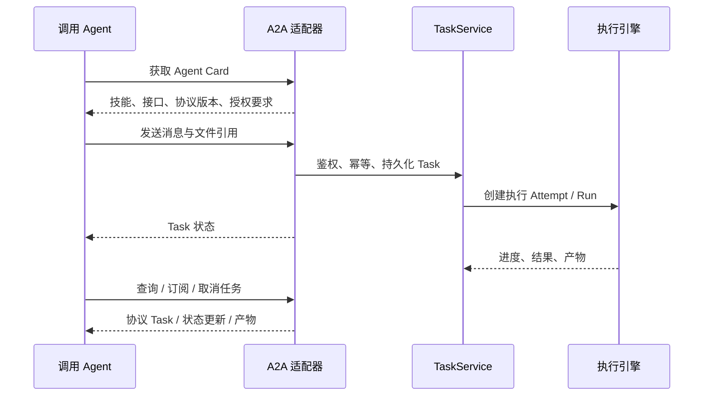

# A2A 接入架构设计

**状态：设计方案，尚未实现 Agent Card 或 A2A 协议端点。** A2A 把 UMEKO 描述为可以接收业务任务并交付结果的 Agent 服务。

## 定位与协议基线

MCP 面向工具调用；A2A 面向 Agent 之间的任务协作。二者在 UMEKO 中共用身份、TaskService 和产物存储，不分别建立永久会话池。

本设计以 **A2A 1.0.0** 为发布规范基线，协议线上的版本为 `1.0`。不能直接套用早期 0.3 示例中的字段和鉴别方式；实现时按选用 SDK 的 1.0 类型生成协议对象。[A2A 1.0.0 规范](https://a2a-protocol.org/v1.0.0/specification/)。

## Agent Card

Card 描述服务名称、说明、可用技能、输入输出类型、支持的接口绑定、协议版本和安全方案。仅发布已经实现并验证的能力：例如没有可靠推送通知时，就不声明支持推送。

规范提供 `/.well-known/agent-card.json` 发现方式，也允许直接配置 Card URL 或使用目录服务。如果公司域名下有多个路径服务，域名根目录的 well-known 路径由网关协调；不能让每个项目自行占用根路径。可以先向调用方提供明确的带前缀 Card URL。

Card 的接口 URL 使用**公共域名和完整前缀**。卡片中的服务接口、安全声明与实际认证中间件必须一致，不应发布内部端口或 Provider Key。[Agent Card 与发现规范](https://a2a-protocol.org/v1.0.0/specification/)。

## 数据映射

| A2A 概念 | UMEKO 建议映射 |
| --- | --- |
| 调用者身份 | Principal，不由 `contextId` 代替 |
| Context | 可选持续上下文；绑定归属与过期策略 |
| Message / Part | 问题、文本、文件与结构化输入 |
| Task | 持久化业务工单 |
| 一次执行 | Task 下的 Attempt，驱动现有 Run |
| Artifact | 报告 / 文件 / 结构化结果，保留访问权限 |
| 状态更新与订阅 | Task 事件适配，支持断线后的状态查询 |

一个 Task 可能包含重试或补充输入产生的多个 Run。协议任务不能简单等同于一个内存 Run，也不能把一条网页聊天会话当成所有任务的共享房间。

当前引擎有 queued、running、cancelling 和三种终态。适配器将这些映射到 A2A 的任务生命周期；如果以后支持要求调用方补充文件或确认，TaskService 还需增加等待输入状态。当前引擎尚无完整的输入补充流程。

## 协议接口与认证

适配器按 A2A 1.0 SDK 实现发送消息、查询任务、取消与订阅操作；不要把已有 `/v1/proxy/sessions` 改名后就宣称协议兼容。

机器调用采用公司 OAuth 或服务凭据，Card 声明所用安全方案；查询、订阅、取消和下载都检查 Task 所有权。多租户系统中，猜到一个任务 ID 不能获得任务内容。

业务任务长时间执行时，连接断开后仍可查询持久化状态。若增加推送通知，还需验证回调目标、持久化投递与重试、凭据管理和幂等接收；初期可以只实现查询与订阅。

## 分阶段交付

1. 完成共享身份与 TaskService，先跑通 REST 业务工单。
2. 发布 Card，明确一个接口绑定与已支持能力。
3. 实现消息提交、状态查询、取消、文件与产物。
4. 增加订阅和等待输入；确有需求时增加推送通知。

用真实 A2A 1.0 客户端验收：Card 发现、协议版本、授权失败、跨身份隔离、长任务、取消、断线查询、多 Part 输入、产物下载、重启与到期处理，以及公司路径前缀。协议兼容性与业务结果正确性分别验证。
