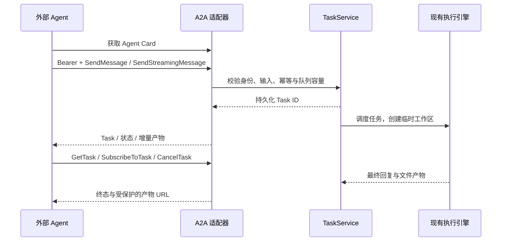

# A2A 接入架构

**已实现 A2A 1.0 JSON-RPC 服务与公开 Agent Card。** 使用官方 `a2a-sdk>=1.2.2,<2` 的 protobuf 类型、路由和客户端，协议请求带 `A2A-Version: 1.0`。

## 当前能力

Card 位于 `/.well-known/agent-card.json`，声明 `/a2a` 的 JSONRPC 1.0 接口、流式能力、Bearer 鉴权和文件处理技能。公开 Card 不包含服务凭据、Provider Key 或主机文件路径。

管理员开启免鉴权后，Card 不再声明必需鉴权；不带 Bearer 的请求共用免鉴权任务身份，带有效凭据仍按服务账号隔离。接入方式从数据库实时读取，不按 IP 鉴权；来源 IP 仅作后台记录。

支持发送、流式发送、查询、分页列表、取消和订阅活跃任务。不提供 gRPC、HTTP+JSON 绑定、推送回调或扩展 Agent Card；相关可选能力未宣称支持，调用时返回明确的协议错误。

输入支持文本、结构化 JSON、内联文件。文件 URL 只接受同一服务、同一调用者有权读取的任务产物，不抓取任意外部 URL。附件限制与 REST / MCP 相同。

## 生命周期映射

| UMEKO | A2A |
| --- | --- |
| queued | SUBMITTED |
| running / cancelling | WORKING |
| completed | COMPLETED |
| failed | FAILED |
| cancelled | CANCELED |

每个 Message 创建独立业务 Task。`messageId` 默认用于幂等；重试同一消息不会重复创建任务。`contextId` 可将自己已有的任务归为一组，**不共享模型记忆**。暂不接受向已有 `taskId` 补充输入，也不支持 INPUT_REQUIRED 工作流。

非流式发送可设 `configuration.returnImmediately=true` 立即拿到 Task；否则等待终态。流式发送依次返回初始 Task、回复增量、最终产物和终态。最终文本以 `append=false` 替换累积片段，防止重连或有界事件历史造成结果不完整。

`GetTask` 可指定 `historyLength`；`ListTasks` 支持分页、context、状态、更新时间过滤及产物选项。产物下载遵循当前接入方式：需要凭据时检查服务账号权限，免鉴权时可直接读取共享身份的产物。取消和业务连接断开的行为与共享 TaskService 一致。

测试使用官方 ClientFactory 在真实 HTTP 服务上发现 Card、发送附件、接收流式 / 非流式结果、查询、列表和下载，并验证部署前缀与跨调用者隔离。模型业务效果需要配置真实 Provider 后另行验证。

请求示例见 [A2A API](../api/a2a.md)。规范参考：[A2A 1.0.1](https://a2a-protocol.org/v1.0.1/specification/)、[官方 Python SDK](https://github.com/a2aproject/a2a-python)。
