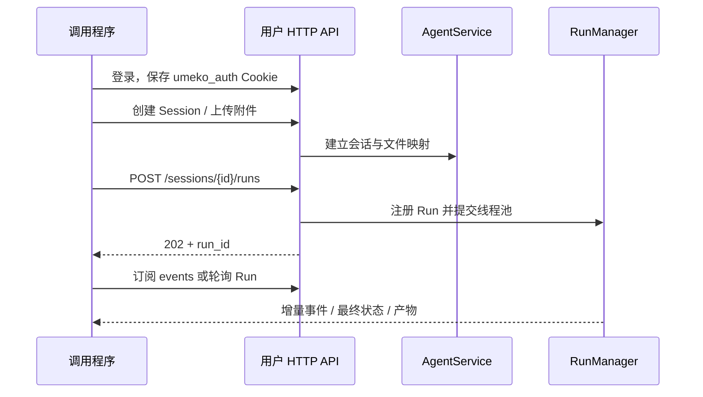
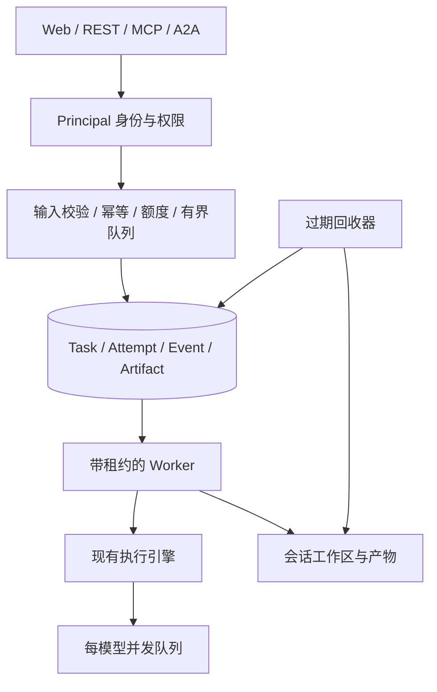

# API 服务架构设计

## 当前实现

**已有 REST API；机器服务身份与持久化 TaskService 尚未实现。** 用户接口与工作台共用 `AgentService`，通过 Cookie 确认身份，按用户和 Session 隔离数据。

现有 `/v1/proxy/sessions` 将上传、创建会话、挂载技能与提问合并成一次请求，但仍使用用户 Cookie，仍创建普通持久化 Session。它没有自动过期机制，也没有把调用者变成匿名机器账号。详见[一次性调用](../api/proxy.md)。

## 为什么大量 API 调用需要另一层

当前线程池会排队，但没有业务队列长度上限；会话缓存、Run 注册表和事件缓冲也没有自动回收。模型并发额度保护的是上游模型，并不能阻止提交大量业务任务消耗内存和磁盘。

此外，Run 状态不落盘。服务重启后，数据库里的聊天历史仍在，但旧 `run_id` 不能继续查询。面向其他系统的服务应提供稳定的业务 Task ID，把持久化、权限与清理放在执行引擎之上。

## 建议的统一 TaskService

**以下均为待实现设计。** Web、REST、MCP 和 A2A 使用同一业务服务，各协议适配器负责输入输出转换。

### 身份不必等于网页账号密码

保留人类用户登录，为程序增加服务账号 `Principal(type=service)`。每个调用者仍有稳定身份，才能限制额度、追踪调用和隔离结果。

REST / A2A 可使用公司 OAuth 或可轮换的服务凭据；凭据只保存摘要，记录到期时间与权限范围。MCP 按其标准授权流程接入，支持的客户端可使用客户端凭据扩展。**调用 UMEKO 的凭据与 UMEKO 调用模型的 Provider Key 是两套凭据。**

权限放在 L2 服务层统一检查，例如 `tasks:create/read/cancel`、`artifacts:read` 和可用技能 / 模型范围。不能只靠某个 FastAPI 中间件，因为 MCP 和进程内调用也必须遵守权限。

### Task、Context、Run 分开

| 对象 | 建议职责 |
| --- | --- |
| Principal | 数据归属、权限、调用额度 |
| Context | 可选的持续对话上下文；一次性调用使用临时上下文 |
| Task | 稳定业务工单，保存输入摘要、状态、结果、到期时间 |
| Attempt / Run | Task 的一次实际执行；重试或补充输入可能有多个 |
| Artifact | 有归属与到期时间的产物，下载前检查权限 |

不要每次机器调用都建立永久网页会话。第一阶段可增加 `purpose=api_ephemeral`、`expires_at` 和工作台过滤，复用现有文件隔离；之后再抽出独立 TaskContext。网页聊天继续保存用户需要的历史。

### 两级排队

业务队列在创建大量工作区、拷贝文件和加载 Agent **之前**检查容量。建议增加全局等待数量、每调用者等待数量和执行数量上限，并做调用者之间的公平调度。

已有的每模型并发控制继续保留：一个任务可能反复调用主模型、子模型和视觉模型，它们分别消耗实际模型额度。公司 LiteLLM 的上游限制与服务本地排队可以并存；上游返回的限流仍要处理，本地排队不等同于 RPM / TPM 控制。

队列满时明确拒绝并给出重试提示，而不是无界积累。REST 可定义 `429` / `Retry-After`，协议适配器转换为各自的错误语义；这不是现有所有接口已经支持的行为。

### 持久化与幂等

建议新增 `principals`、`service_credentials`、`tasks`、`task_attempts`、`task_events`、`task_artifacts` 表。任务保存状态、归属、上下文引用、取消标记、输入摘要、租约和过期时间。

调用者提供幂等键，同一身份、同一键、同一输入只创建一个 Task；同一键但不同输入返回冲突。任务先落盘再确认接收，避免返回成功却没有工单。

Worker 原子认领任务并更新租约。重启后可重新调度尚未开始的任务；已经执行但失去租约的任务标记中断或失败，按业务策略重试。保存状态不能自动恢复到模型或工具执行的任意中间步骤；外部副作用要另行设计幂等。

## 生命周期与清理建议

下面是起步建议值，**尚未配置或实现**，应按业务保留要求调整。

| 资源 | 建议策略 |
| --- | --- |
| 已完成的 Agent 内存对象 | 尽快释放，查询结果读取持久化 Task |
| 空闲网页 Agent 缓存 | 30 分钟淘汰内存，保留数据库历史 |
| 一次性输入和中间文件 | 完成后保留 24 小时 |
| 报告与任务元数据 | 默认保留 7 天，响应说明到期时间 |
| 任务事件 | 有界保存，客户端可退回状态轮询 |

内存、数据库和磁盘分别清理。清理器检查有效租约，不删除正在执行的文件；下载前检查到期状态。需要延长保留的报告可以显式归档。

## 实施顺序与验收

1. 增加机器身份、L2 权限与持久化 Task；REST 先接入。
2. 增加有界业务队列、幂等、过期回收和重启状态处理。
3. 接入 MCP，再接入 A2A，共用以上业务服务。
4. 单机容量不足时再增加共享队列与对象存储；多个进程需要共享模型额度。

验收至少覆盖：跨身份无法读取 Task 和产物；重复幂等提交只有一份任务；队列满有明确响应；模型额度为 2 时实际上游同时请求不超过 2；取消等待任务不会发出模型请求；重启后状态可解释；过期清理不影响活跃任务；带路径前缀时所有产物和协议入口可达。
