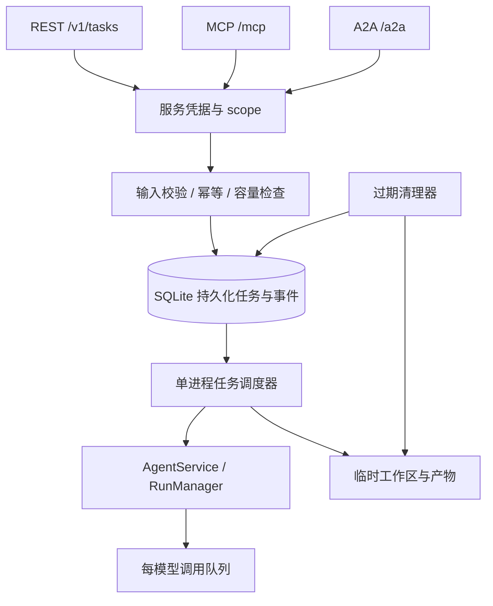

# API 服务架构

UMEKO 提供两种生命周期：网页会话保留聊天历史；机器任务接收一次输入，持久化结果，并按到期时间清理。REST、MCP、A2A 的机器入口共用 `TaskService`，执行时复用 `AgentService` 和模型队列。

## 身份与权限

管理员在“服务接入”创建服务账号。内部复用用户 ID 作为文件归属，但账号类型为 `service`，不能用网页用户名密码登录，也不出现在普通用户列表中。

凭据只存 SHA-256 摘要，支持有效期、停用和更换。可直接传 Bearer 服务凭据，也可通过 OAuth `client_credentials` 换取有 scope 和 resource 限制的短期令牌。凭据更换或停用会撤销其短期令牌。

权限在 `IdentityStore` / `TaskService` 检查，而不只放在某个协议的中间件。任务查询、取消和下载同时检查调用者归属；知道任务 ID 并不能读取别人数据。调用 UMEKO 的凭据与 Provider 的模型 API Key 分开管理。

## 对象与持久化

| 对象 | 当前行为 |
| --- | --- |
| 服务账号 | 稳定的数据归属、scope、未结束任务额度 |
| Task | 持久化 ID、输入文本和附件摘要、状态、最终回复、错误、到期时间 |
| Context | A2A 的分组 ID；同组任务仍各自独立执行，不共享模型对话记忆 |
| Session / Run | Worker 执行时才创建的内部工作区和运行；机器 Session 不进入网页聊天列表 |
| Event | 每个任务最多保存最近 500 条，单条引擎事件内容最多 16 KiB |
| Artifact | 工作区与生成目录中的文件；下载时重新检查归属、路径边界和到期时间 |

`service_tasks`、`service_task_events`、`service_task_artifacts` 保存业务结果。Session、Run、Agent 的内存对象在机器任务结束后释放，模型连接也关闭；后续查询和下载读取数据库与磁盘，不重新加载 Agent。

原有 `/v1/sessions` 和 `/v1/proxy/sessions` 继续使用网页 Cookie 与普通 Session。它们没有机器任务的自动过期机制，旧 Run 状态仍在内存中。新调用方建议使用 [机器任务 API](../api/machine-tasks.md)。

## 两级排队

1. **任务级**：输入校验后，在 SQLite 事务中检查全局等待数量和每个调用者的未结束任务数量。通过后才保存输入文件；执行时才加载 Agent。FIFO 调度，有固定数量的任务 Worker。
2. **模型级**：任务执行中的每次主模型、子模型或视觉模型请求，继续使用 Provider 页面配置的每模型额度。额度为空表示无限制；同模型的网页和机器调用共享进程内队列。

默认任务 Worker 4、全局等待任务 100、每调用者未结束任务 20。任务 Worker 数量不是上游模型并发额度；现有 Run 执行池也有容量限制。队列满时 REST 返回 `429` 和 `Retry-After: 5`；MCP 返回工具错误，A2A 返回带重试提示的协议错误。

本地并发限制不能替代 LiteLLM 的 RPM / TPM 或其他服务共享的额度。上游仍可能限流；调用方应按错误和幂等键重试。

## 幂等、取消、重启与清理

- 同一调用者、同一幂等键、同一输入返回原 Task；不同输入返回冲突。A2A 默认使用 `messageId` 派生幂等键。记录到期清理后该键可以重新使用。
- 排队任务立即取消；执行中任务向模型、工具传播协作式取消。取消响应不代表所有外部操作都已经停止。
- 接收任务后，即使调用方断开，业务任务继续执行。需要停止时显式调用取消入口。
- 服务重启恢复尚未执行的排队任务；运行或取消中的任务标记失败，说明执行中断。不会自动重放可能已经产生副作用的工具。
- 任务结束后默认保留结果和工作区 24 小时；约每 60 秒清理到期终态任务，跳过活跃任务。到期资源立即不可读，磁盘清理可能稍后完成。
- 输入暂存目录在任务结束或排队取消后清理。尚未到期的产物继续可下载。

部署参数见 [部署指南](../deployment.md)。目前是**一个应用进程、一个持久化数据目录**。未实现分布式 Worker 租约、跨进程模型额度、对象存储、公平调度或多轮补充输入；扩容时需要共享队列和执行协调，不能直接增加 Uvicorn 进程数。

源码：`umeko/host/identities.py`、`tasks.py`、`umeko/server/task_api.py`、`protocols.py`。
