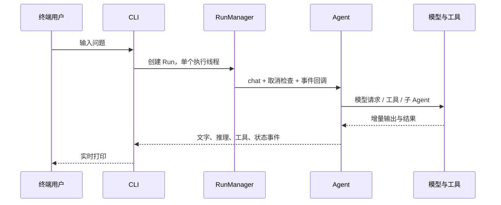

# CLI 架构设计

**状态：已实现。** CLI 是终端入口，直接驱动 Agent 执行引擎。它不需要先启动 Web 服务，也不通过 HTTP 调用工作台。

## 配置与启动

```sh
python -m umeko.cli --env .env --data-root server_data providers list
python -m umeko.cli --data-root server_data providers import providers.example.json
python -m umeko.cli --data-root server_data providers use MODEL_ID
python -m umeko.cli --data-root server_data
```

全局参数放在 `providers` 子命令前面。`MODEL_ID` 是 `providers list` 输出的模型 ID，不是模型名称。

CLI、Web 与本地工作台通过 `host/configuration.py` 读取同一 Provider 注册表。若要共享模型配置，必须指向**同一个数据目录**。`.env` 保存部署配置；模型 URL、Key、名称和每模型并发上限保存在 SQLite。

旧配置可显式迁移：

```sh
python -m umeko.cli --env .env providers migrate-env
# 确认迁移成功后，可以使用 --remove 清理旧模型环境项
python -m umeko.cli --env .env providers migrate-env --remove
```

## 一轮提问的流程



CLI 创建独立的 `Session` 和 `RunManager(max_workers=1)`。当前终端聊天记录不进入 Web 的用户会话数据库，文件产物使用本地输出目录。数据库在这里主要提供模型配置。

本地技能目录中的名称与简介随模型请求提供，完整指引只在任务相关或明确指定技能时通过 `use_skill` 读取。一轮结束后正文退出工作上下文，需要时下轮重新读取；机制与网页、机器任务一致，见[技能的按需加载](index.md#skill-loading)。

## 控制与生命周期

| 操作 | 行为 |
| --- | --- |
| `/quit`、`/exit` | 退出终端 |
| `/reload` | 重新读取模型配置并开始新的对话上下文 |
| `/stats` | 显示上下文统计 |
| `/compact` | 压缩当前上下文 |
| `/clear` | 清空当前上下文 |
| 执行中 `Ctrl+C` | 请求协作式取消并等待当前任务退出 |

取消信号会传播到模型排队、流式请求和工具执行。已经在外部系统发生的动作不能靠取消自动撤销。

## 与服务端的关系

同一进程中，相同注册表模型 ID 的主模型、子模型、视觉模型共用并发额度。**独立 CLI 进程与 Web 进程不共享额度**，即使它们读取同一数据库。需要全局额度时，应把执行收敛到统一服务，或实现跨进程限流。

当前 Web 的执行入口有异常转为失败终态的兜底，CLI 的执行入口还需统一这部分处理。后续 CLI 若用于自动化，建议增加明确退出码、JSON 事件输出，并复用 TaskService；这些是扩展项。

源码：[cli.py](https://github.com/umeiko/UmEkO/blob/main/umeko/cli.py)、[runner.py](https://github.com/umeiko/UmEkO/blob/main/umeko/runner.py)、[配置解析](https://github.com/umeiko/UmEkO/blob/main/umeko/host/configuration.py)。
