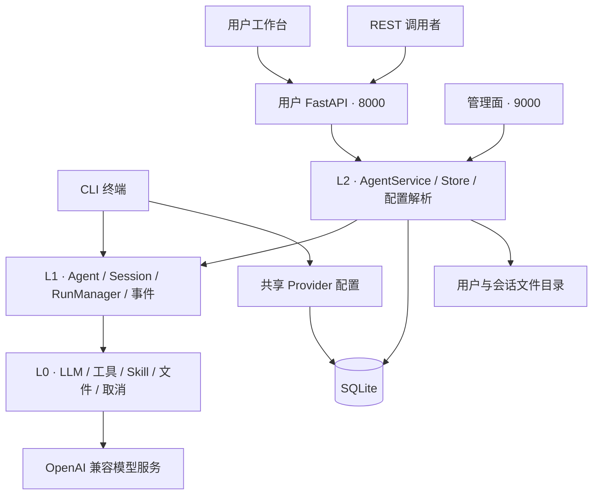
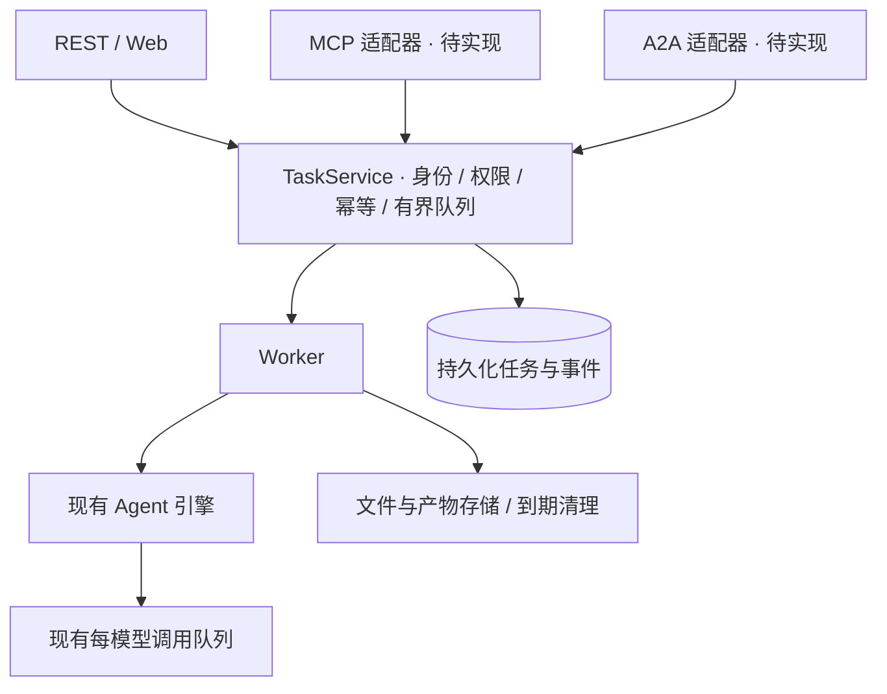

# 架构设计概览

**状态：CLI、Web 和 REST API 已实现；MCP、A2A、持久化机器任务服务属于设计方案。** 文档按这条边界描述系统，避免把规划当成现有能力。

## 当前分层

| 层 | 职责 | 主要源码 |
| --- | --- | --- |
| L0 基础能力 | 模型客户端、并发控制、图片、技能包、取消信号 | `umeko/llm/`、`skillpacks.py`、`cancellation.py` |
| L1 执行引擎 | 主 Agent / 子 Agent、上下文、单次 Run 与事件 | `agent.py`、`sub_agent.py`、`session.py`、`runner.py` |
| L2 宿主服务 | 用户会话、文件隔离、持久化、模型选择 | `umeko/host/` |
| L3 接入层 | CLI、用户 HTTP、管理 HTTP、本地工作台 | `cli.py`、`server/`、`local.py` |

CLI 目前直接使用执行引擎；它共享 Provider 配置，却没有复用 Web 的用户登录和持久化会话流程。Web 与 REST 使用同一个 `AgentService`。管理面共享服务与数据库，但监听独立端口。

## 四个容易混淆的名字

| 概念 | 通俗解释 | 当前 / 规划 |
| --- | --- | --- |
| User / Principal | 谁发起调用，谁拥有数据 | 当前有用户；机器身份待扩展 |
| Session | 一个持续聊天的房间，包含上下文和文件 | 已实现、持久化历史 |
| Run | 在房间里执行的一轮提问 | 已实现，运行态与事件在内存 |
| Task | 外部系统提交的业务工单，能跨重启查询 | 待实现，不等同于当前 Run |

数据库保存用户、会话、消息、工具历史、附件映射和 Provider 配置。正在运行的 Agent、Run 状态、SSE 事件与模型排队都在进程内存中。因此当前部署要求**一个应用进程**；增加 worker 数量不会自动获得共享运行状态。

## 下一步的统一接入层

新协议应复用业务服务，不各自复制一套 Agent、会话与文件管理。机器调用的生命周期问题先在 [API 服务设计](api-service.md)解决，再接入 [MCP](mcp.md) 和 [A2A](a2a.md)。

## 阅读顺序

1. [CLI](cli.md)：配置解析、终端执行与取消。
2. [Web Server](webserver.md)：双端口、网页、代理、存储与流式。
3. [API 服务](api-service.md)：现有接口和机器调用的扩展基础。
4. [MCP](mcp.md)：把能力作为工具交给其他模型客户端。
5. [A2A](a2a.md)：把 UMEKO 作为可协作的 Agent 服务。

源码导航：[GitHub umeko 目录](https://github.com/umeiko/UmEkO/tree/main/umeko)。
