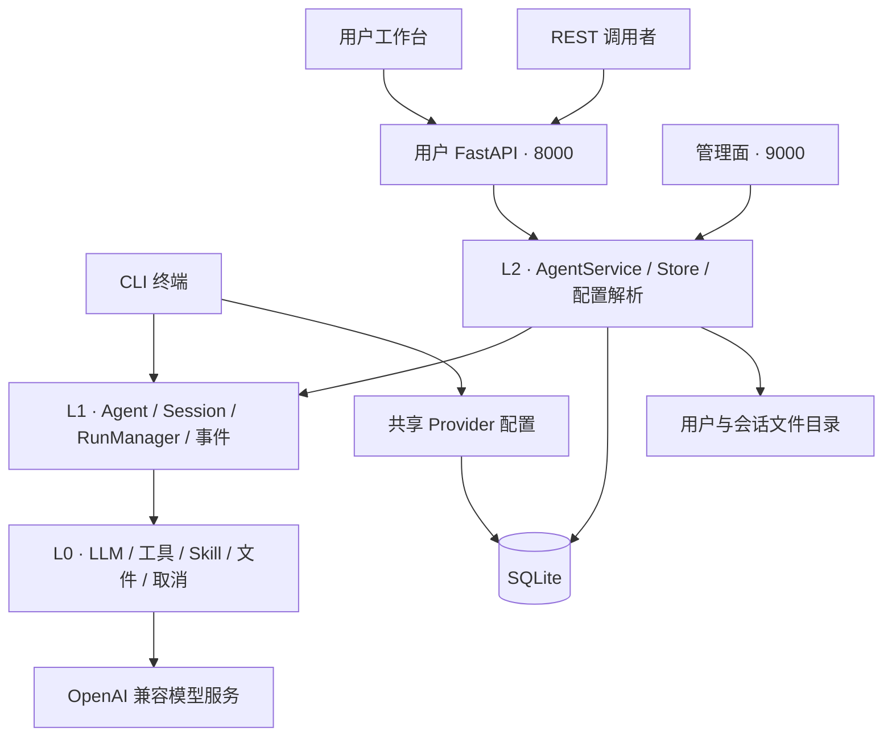
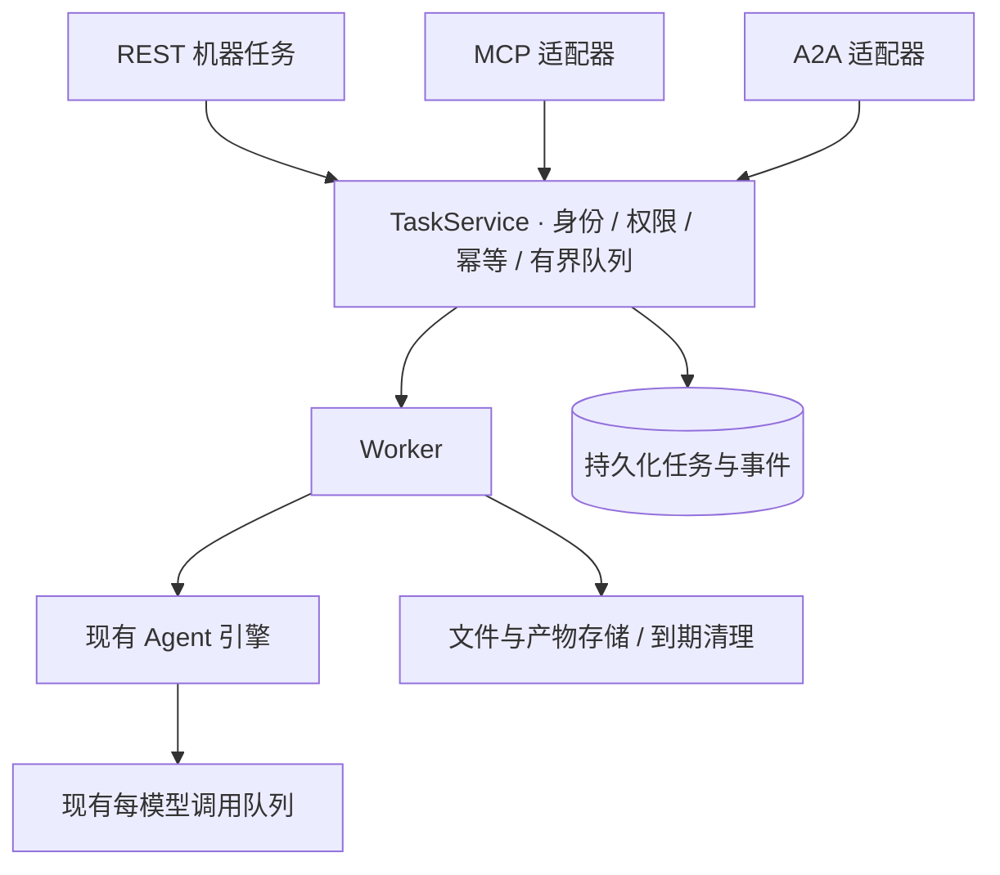

# 架构设计概览

**CLI、Web、REST、MCP、A2A、多智能体管理和持久化机器任务服务均已实现。** 网页聊天与机器任务共用执行引擎，使用不同的生命周期。多个 Agent 可使用不同路径、介绍、工作指引和技能选择，共享 Provider 与模型并发队列。

## 当前分层

| 层 | 职责 | 主要源码 |
| --- | --- | --- |
| L0 基础能力 | 模型客户端、并发控制、图片、技能包、取消信号 | `umeko/llm/`、`skillpacks.py`、`cancellation.py` |
| L1 执行引擎 | 主 Agent / 子 Agent、上下文、单次 Run 与事件 | `agent.py`、`sub_agent.py`、`session.py`、`runner.py` |
| L2 宿主服务 | Agent 配置、用户会话、服务身份、任务队列、文件隔离、持久化、模型选择 | `umeko/host/` |
| L3 接入层 | CLI、用户 / 管理 HTTP、REST、MCP、A2A、本地工作台、资源采样 | `cli.py`、`server/`、`local.py` |

CLI 目前直接使用执行引擎；它共享 Provider 配置，却没有复用 Web 的用户登录和持久化会话流程。Web 与 REST 使用同一个 `AgentService`。管理面共享服务与数据库，但监听独立端口。

## 四个容易混淆的名字

| 概念 | 通俗解释 | 当前行为 |
| --- | --- | --- |
| User / Principal | 谁发起调用，谁拥有数据 | 人类用户与服务账号，各自授权 |
| Session | 一个持续聊天的房间，包含上下文和文件 | 已实现、持久化历史 |
| Run | 在房间里执行的一轮提问 | 已实现，运行态与事件在内存 |
| Task | 外部系统提交的业务工单，能跨重启查询 | 已实现，持久化结果与到期清理 |

数据库保存用户、会话、消息、工具历史、附件映射、Provider、服务凭据摘要、机器任务与有界事件。网页 Run 状态、Agent 与模型队列仍在进程内存中。部署要求**一个应用进程**；增加 Uvicorn worker 不会自动获得共享调度和模型额度。

## 机器调用的统一接入层

三个机器入口复用业务服务。身份、幂等、容量、取消和清理在 [API 服务](api-service.md)统一处理，协议转换见 [MCP](mcp.md) 和 [A2A](a2a.md)。管理端提供“服务接入”和“资源监控”，见[监控指南](../api/monitoring.md)。

## 阅读顺序

1. [CLI](cli.md)：配置解析、终端执行与取消。
2. [Web Server](webserver.md)：双端口、网页、代理、存储与流式。
3. [API 服务](api-service.md)：现有接口和机器调用的扩展基础。
4. [MCP](mcp.md)：把能力作为工具交给其他模型客户端。
5. [A2A](a2a.md)：把 UMEKO 作为可协作的 Agent 服务。
6. [多智能体管理](agents.md)：独立路径、技能选择、执行快照与共享额度。

源码导航：[GitHub umeko 目录](https://github.com/umeiko/UmEkO/tree/main/umeko)。
