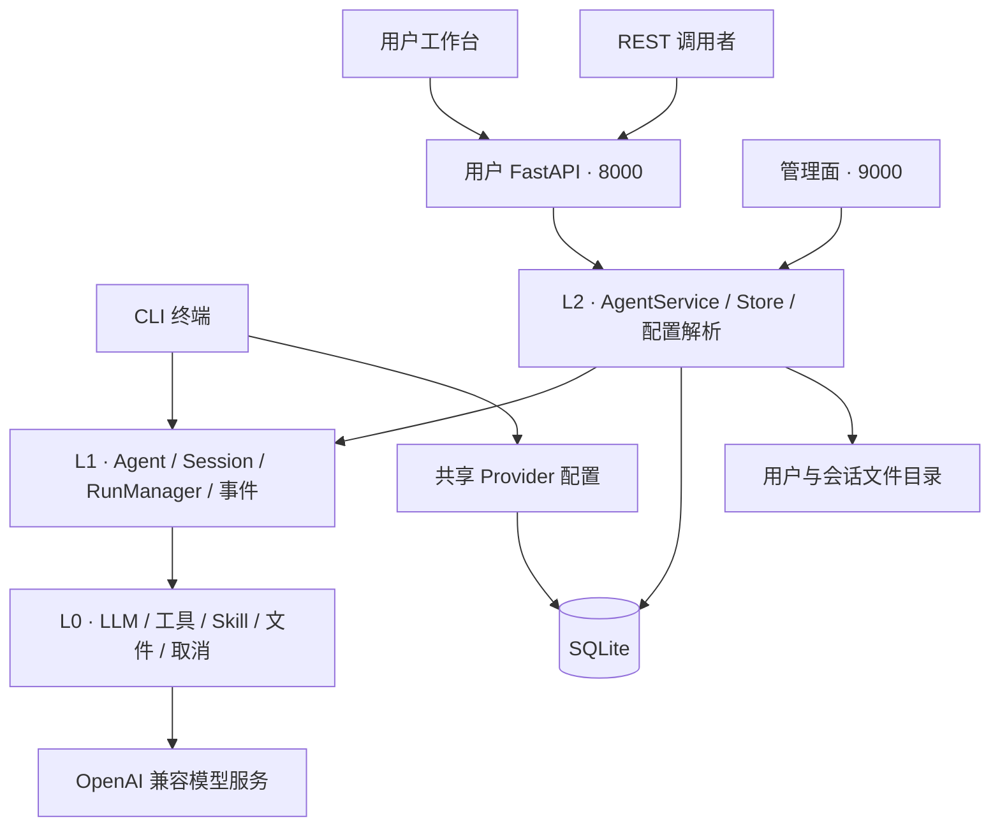
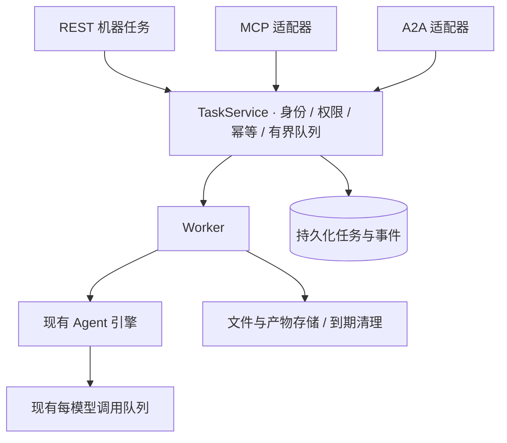

# 架构设计概览

**CLI、Web、REST、MCP、A2A、多智能体管理和持久化机器任务服务均已实现。** 网页聊天与机器任务共用执行引擎，使用不同的生命周期。多个 Agent 可使用不同路径、介绍、工作指引和技能选择，共享 Provider 与模型并发队列。

## 当前分层

| 层 | 职责 | 主要源码 |
| --- | --- | --- |
| L0 基础能力 | 模型客户端、并发控制、图片、技能包、取消信号 | `umeko/llm/`、`skillpacks.py`、`cancellation.py` |
| L1 执行引擎 | 主 Agent / 子 Agent、上下文、单次 Run 与事件 | `agent.py`、`sub_agent.py`、`session.py`、`runner.py` |
| L2 宿主服务 | Agent 配置、用户会话、服务身份、任务队列、文件隔离、持久化、模型选择 | `umeko/host/` |
| L3 接入层 | CLI、用户 / 管理 HTTP、REST、MCP、A2A、本地工作台、资源采样 | `cli.py`、`server/`、`local.py` |

CLI 目前直接使用执行引擎；它共享 Provider 配置，却没有复用 Web 的用户登录和持久化会话流程。Web 与 REST 使用同一个 `AgentService`。管理面共享服务与数据库，但监听独立端口。

## 四个容易混淆的名字

| 概念 | 通俗解释 | 当前行为 |
| --- | --- | --- |
| User / Principal | 谁发起调用，谁拥有数据 | 人类用户与服务账号，各自授权 |
| Session | 一个持续聊天的房间，包含上下文和文件 | 已实现、持久化历史 |
| Run | 在房间里执行的一轮提问 | 已实现，运行态与事件在内存 |
| Task | 外部系统提交的业务工单，能跨重启查询 | 已实现，持久化结果与到期清理 |

数据库保存用户、会话、消息、工具历史、附件映射、Provider、服务凭据摘要、机器任务与有界事件。网页 Run 状态、Agent 与模型队列仍在进程内存中。部署要求**一个应用进程**；增加 Uvicorn worker 不会自动获得共享调度和模型额度。

## 机器调用的统一接入层

三个机器入口复用业务服务。身份、幂等、容量、取消和清理在 [API 服务](api-service.md)统一处理，协议转换见 [MCP](mcp.md) 和 [A2A](a2a.md)。管理端提供“服务接入”和“资源监控”，见[监控指南](../api/monitoring.md)。

## 技能的按需加载 {#skill-loading}

技能加载由 `Session` 与 `UmekoAgent` 实现，CLI、网页聊天和 REST / MCP / A2A 任务使用同一机制。每次主模型请求只临时附上技能的 `name` 与 `description`，不把全文拼入用户消息或反复写入聊天历史。模型根据适用场景选择技能；任务相关或用户明确指定时，调用 `use_skill` 读取完整指引，无关任务直接跳过。

网页中“启用按需使用”决定哪些技能出现在简介目录里；原有 `mounted` 状态兼容保留。CLI 自动列出本地可用技能；机器任务自动列出当前 Agent 选择并允许访问的技能。网页未启用的技能仍可通过 `list_skill_packs` 发现、按明确要求读取；停用是目录偏好，机器 Agent 的技能选择则是访问边界。

全文只在当前一次 `chat` / Run 的工作上下文里保留。同一任务重复读取相同版本返回短引用；内容变化时替换旧版本。结束、取消或失败后，工具消息保留调用关系，但正文替换为短引用，完整执行结果仍留在工具日志中。下轮需要用到时重新读取；清空、恢复或压缩上下文后也不会因旧“已加载”标记而遗漏正文。

该机制减少技能提示的重复占用，不保证模型永远正确选择技能。应在 `description` 中写清适用场景与触发条件；明确使用某技能时，可在任务中直接指定。附属文档与脚本继续通过现有工具按需读取或执行，主模型委派文件子 Agent 时需把本次所需指引写入子任务。

## 图像理解与质检流程

`image_reasoning` 是通用视觉工具，支持图片内容、图表、界面布局、比较、检查和 OCR；文字识别只是其中一种用途，用户不必明确说“做 OCR”。主模型使用纯文本输入时，仍可把用户问题、图片路径和上下文传给独立视觉模型，再根据工具结果回答。

主 Agent 的能力提示由实际工具表生成：有 `image_reasoning` 就使用视觉工具；只有文件子 Agent 有视觉能力时，可以委派完整的图像任务；两者及原生图像输入都不可用时，才说明需要配置视觉模型。子 Agent 按本次允许的工具集合生成提示，避免声称被禁用的工具仍可用。该机制是共享执行引擎的能力，CLI、网页和机器任务一致。

普通看图按用户要求分析，无需先加载技能。专业质检与报告任务仍先读取相关 Skill，依照其角色分工、检查标准、证据要求和报告流程执行。`doc-image-qc` 的主 Agent 继续负责编排，逐图检查交给文件子 Agent；通用视觉提示不会取代技能流程。已有会话重新装配后使用新的能力提示，历史对话仍保留；提示能改善模型决策，但不构成强制业务路由。

## 阅读顺序

1. [CLI](cli.md)：配置解析、终端执行与取消。
2. [Web Server](webserver.md)：双端口、网页、代理、存储与流式。
3. [API 服务](api-service.md)：现有接口和机器调用的扩展基础。
4. [MCP](mcp.md)：把能力作为工具交给其他模型客户端。
5. [A2A](a2a.md)：把 UMEKO 作为可协作的 Agent 服务。
6. [多智能体管理](agents.md)：独立路径、技能选择、执行快照与共享额度。

源码导航：[GitHub umeko 目录](https://github.com/umeiko/UmEkO/tree/main/umeko)。
