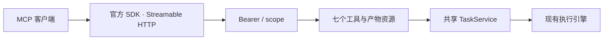

# MCP 接入架构

**已实现 Streamable HTTP MCP 服务，入口 `/agent/{slug}/mcp`。** 使用官方 Python SDK `mcp>=2.3,<3`，通过 SDK 处理现代请求级协商以及旧版初始化客户端。服务工具调用返回业务 Task，不让一条 MCP 请求长期占用 Agent 执行连接。

## 工具与资源

`get_agent_info`、`list_models`、`submit_task`、`get_task`、`list_tasks`、`cancel_task`、`read_artifact` 提供结构化结果。产物另有 `umeko://tasks/{task_id}/artifacts/{artifact_id}` 资源模板；小文件通过 MCP 读取，大文件通过受保护 HTTP 下载。

工具可被发现，不代表凭据有权限执行。每次调用检查 scope 和任务归属。模型发现只返回 ID、名称、视觉能力和 Provider 名称，不返回模型地址或密钥。

长任务使用 `submit_task → get_task → read_artifact` 的业务轮询流程。当前未声明 MCP 原生 Tasks 扩展，不把业务 Task ID 当成该扩展的协议任务。取消 MCP 请求或断开连接不会取消已经接收的业务 Task，需要显式 `cancel_task`。

## 授权与部署

管理员创建服务凭据，调用方发送 `Authorization: Bearer <token>`。也提供受保护资源元数据、授权服务器元数据和 OAuth 客户端凭据令牌入口。当前没有交互式 OAuth 登录、授权码 / PKCE、动态客户端注册，也没有 stdio 传输。需要交互式 OAuth 的客户端应先确认是否支持自定义 Header 或客户端凭据流程。

管理员也可开启免鉴权，客户端省略 Authorization 直接调用。此模式使用共享任务身份；IP 只写入后台记录，不参与授权。有效 Bearer 调用仍采用对应服务账号的 scope 与数据归属。

生产配置 `UMEKO_PUBLIC_URL`，确保外部 Host 被 MCP 的 DNS 重绑定保护接受，资源 metadata 和下载链接使用正确的域名与前缀。NGINX 保留 Authorization、允许足够请求大小、关闭协议流的缓冲；详情见 [部署指南](../deployment.md)。

验证使用官方 `mcp.client.Client`，覆盖现代与 legacy 客户端、根路径与公司路径前缀、附件、结果、资源和取消；业务身份隔离、容量限制、轮换与过期清理由共享 TaskService 测试覆盖。测试使用受控 Agent 回复，不调用真实模型。

接入步骤、工具参数和客户端示例见 [MCP API](../api/mcp.md)。规范参考：[MCP 2026-07-28](https://modelcontextprotocol.io/specification/2026-07-28)、[官方 Python SDK](https://github.com/modelcontextprotocol/python-sdk)、[客户端凭据扩展](https://modelcontextprotocol.io/extensions/auth/oauth-client-credentials)。
