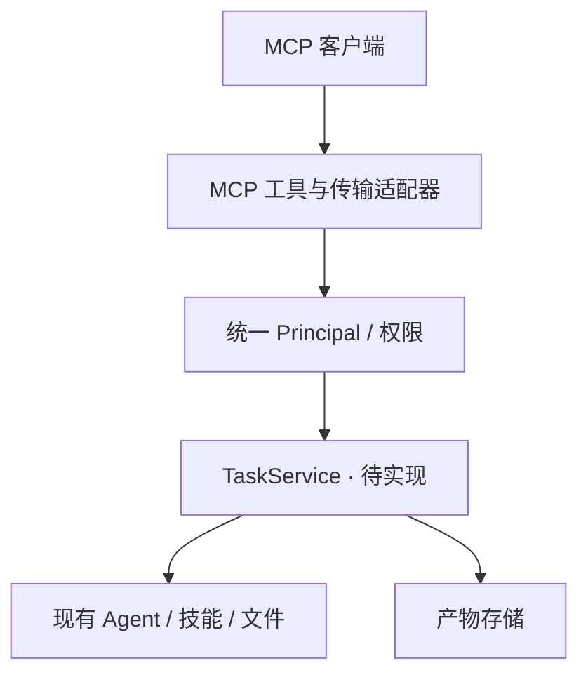

# MCP 接入架构设计

**状态：设计方案，尚未实现 MCP 端点。** 当前 REST API 不能直接当作 MCP 服务，仍需协议适配、工具描述、授权与生命周期处理。

## MCP 对这个项目的作用

MCP 让其他支持该协议的模型客户端发现并调用 UMEKO 的工具。调用者掌握自己的对话，UMEKO 提供“处理这份文件”“查询处理进度”“下载报告”等能力。

本设计以 **MCP 2026-07-28** 的核心传输与授权规范为基线；长任务采用单独的 Tasks 扩展。实现时必须核对选用 SDK 和客户端实际支持的版本。[MCP 规范](https://modelcontextprotocol.io/specification/2026-07-28)、[Streamable HTTP](https://modelcontextprotocol.io/specification/2026-07-28/basic/transports/streamable-http)。

## 工具契约建议

以下名称是 UMEKO 的拟议业务工具，不是 MCP 规定的通用方法。

| 工具 | 输入 | 输出 / 约束 |
| --- | --- | --- |
| `submit_task` | 技能、问题、文件引用、可选幂等键 | 稳定 Task ID、状态、到期时间 |
| `get_task` | Task ID | 状态、进度、结构化结果和产物引用 |
| `cancel_task` | Task ID | 取消请求是否接受与当前状态 |
| `read_artifact` | Task ID、产物 ID | 在大小与类型限制内返回内容或受控引用 |

文件引用绑定当前 Principal，不能接受任意服务器绝对路径。大型文件通过独立上传能力或受控资源机制交换；大型报告通过受控下载交付，避免把整份文件塞进模型上下文。

工具描述应标明输入限制、耗时、是否有副作用和返回结构。工具列表按权限过滤；模型、Key、管理员 API 和服务器内部路径不作为普通工具暴露。

## 传输与长任务

核心 Streamable HTTP 的协议请求不能沿用旧版 MCP 的初始化和会话假设：2026-07-28 采用请求级能力协商，移除了旧的协议会话和独立 GET 事件流。POST 请求中的 SSE 断开按该传输的取消语义处理。[传输规范](https://modelcontextprotocol.io/specification/2026-07-28/basic/transports/streamable-http)。

UMEKO 的普通 REST SSE 断开会让业务 Run 继续执行。两种传输语义不能直接混用；MCP 适配器必须明确请求取消与持久化 Task 取消的关系。

长任务有两种兼容路径：

1. 客户端和服务端都支持 **Tasks 扩展**时，按扩展声明能力，持久化任务后返回任务结果，并支持 `tasks/get`、输入补充与协作式取消。
2. 不支持扩展时，`submit_task` 快速返回业务 Task ID，客户端通过 `get_task` 轮询。不能擅自给不支持扩展的客户端返回扩展结果。

Tasks 使用 `io.modelcontextprotocol/tasks` 扩展能力，并通过请求协商。Task 的完成、失败、取消、等待输入与有效期均由适配器转换；中间状态由 TaskService 提供，不能只保存在 HTTP 连接中。[Tasks 扩展](https://modelcontextprotocol.io/extensions/tasks/overview)。

## 授权与地址

HTTP MCP 按标准授权规范提供受保护资源信息与 OAuth 接入。无人值守客户端可在双方支持时采用 OAuth Client Credentials 扩展，接入公司的机器身份；不能假定所有 MCP 客户端支持手填 API Key。[授权规范](https://modelcontextprotocol.io/specification/2026-07-28/basic/authorization)、[客户端凭据扩展](https://modelcontextprotocol.io/extensions/auth/oauth-client-credentials)。

拟议入口如 `https://example.internal/doc-master/consistency/image-text/mcp`。公开地址、OAuth 资源标识和下载引用使用外部完整 URL，不能把 `127.0.0.1:8000` 写给外部客户端。NGINX / ALB 对 SSE 与长连接的配置也需验证。

## 实施与验收

先完成 [TaskService](api-service.md)，选择明确支持目标协议版本的 SDK，再实现适配器。可以先验证本地 stdio 工具调用，再验证生产 HTTP、OAuth 和路径前缀。

验收覆盖工具发现、合法 / 非法参数、权限隔离、提交 / 查询 / 取消、客户端断开、Tasks 支持与不支持两条路径、文件交付和长任务过期。需要真实 MCP 客户端互操作测试；仅用 REST 测试成功不能证明 MCP 兼容。
