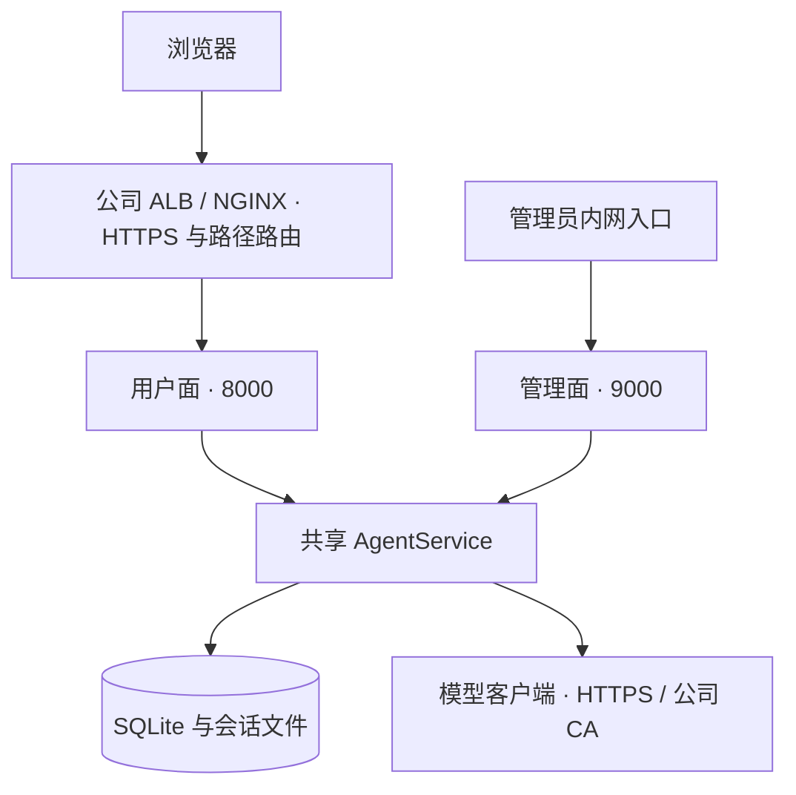

# Web Server 架构设计

**状态：已实现。** 默认启动一个 Python 进程，在两个端口提供用户面与管理面。网页使用 Vue 3 与 Vite 构建，静态资源与 Python 服务一起发布，业务请求由 FastAPI 处理。

## 入口与信任边界



用户面包括登录、聊天、文件、模型偏好和 REST API。管理面包括用户、Provider / Model、默认技能、脚本和运行参数。用户面的应用没有管理路由；管理端口默认绑定 `127.0.0.1`，需另行配置受控访问。

`CLOUD_PROFILE` 开启登录和路径遮蔽，关闭通用命令工具；`LOCAL_PROFILE` 为个人本机免登录，并允许本地命令。文件工具的路径约束不等同于操作系统容器隔离，管理面配置的 Python 技能脚本应当来自受信任的作者。

## 页面、API 与流式

前端源码在 `frontend/`，工作台和管理端是两个构建入口。管理端通过 Vue 状态和组件维护智能体、服务账号、模型、技能、用户、会话和资源监控。工作台拆分为会话栏、文件栏、对话、预览和弹窗组件，原有流式、文件与多语言逻辑由生命周期控制器管理；组件卸载时关闭流式连接并清理全局监听和计时器。详细结构与开发流程见[前端开发](../frontend.md)。

页面加载后会读取当前用户、模型和会话。提交问题调用 `POST /v1/sessions/{id}/runs`，服务立即返回 Run；随后网页从 `GET /v1/runs/{id}/events` 读取 SSE。

Run 产生文字增量、工具状态、子 Agent 事件和最终结果。执行中的工具在聊天区展示，已经结束的工具可进入折叠历史；工具历史也持久化在 SQLite，便于恢复页面。

SSE 连接断开不会自动取消 Run。网页可以带 `Last-Event-ID` 重新连接，重放当前进程保存的后续事件。重启会丢失 Run 与 SSE 缓冲，所以这还不是持久化业务任务系统。

## 为什么部署前缀会影响整个页面

公司可能把公共地址 `/doc-master/consistency/image-text/` 路由到服务器 `8000` 端口。网页的脚本、API、流式和下载地址都需要经过同一公共前缀。

```text
浏览器：/doc-master/consistency/image-text/v1/runs/xxx/events
代理：去掉 /doc-master/consistency/image-text 一次
应用：/v1/runs/xxx/events
```

`UMEKO_BASE_PATH` 显式声明这个前缀，启动时注入 HTML，同时用于 ASGI `root_path`、Cookie Path 和产物 URL。前缀无需重新构建前端。代理应统一处理所有子路径，不能只把首页转发成功就认为部署完成。

NGINX 要关闭 SSE 缓冲，并给予长任务足够的读取超时。HTTPS 页面访问模型的链路由服务器负责；公司私有 CA 使用 `MODEL_CA_FILE` 追加信任，保留证书验证。完整配置见[部署指南](../deployment.md)。

## 数据与运行资源

```text
UMEKO_DATA_ROOT/
  umeko.db
  users/<user_id>/sessions/<session_id>/
    workspace/       用户工作区
    attachments/     对话附件
    generate/        Agent 产物
    client/skills/   会话技能
```

`AgentService` 懒加载会话并缓存 Agent，`RunManager` 使用 4 个执行线程。执行线程数量与模型并发额度是两件事：一个业务 Run 可多次调用不同模型；等待模型额度的 Run 也会占用执行线程。

当前没有自动会话缓存淘汰、Run / SSE 缓冲回收或业务 TTL 清理。SQLite 保存历史，但这些内存对象仍需要明确生命周期；机器大量调用时按 [API 服务设计](api-service.md)扩展。

## 部署约束

当前采用单应用进程，反向代理在外层处理公共 HTTPS 与路径。SQLite、会话文件和技能库都要备份；根目录 `skills/` 中的管理脚本不包含在仅备份数据目录的操作里。

源码：[server/app.py](https://github.com/umeiko/UmEkO/blob/main/umeko/server/app.py)、[server/admin.py](https://github.com/umeiko/UmEkO/blob/main/umeko/server/admin.py)、[host/service.py](https://github.com/umeiko/UmEkO/blob/main/umeko/host/service.py)。
