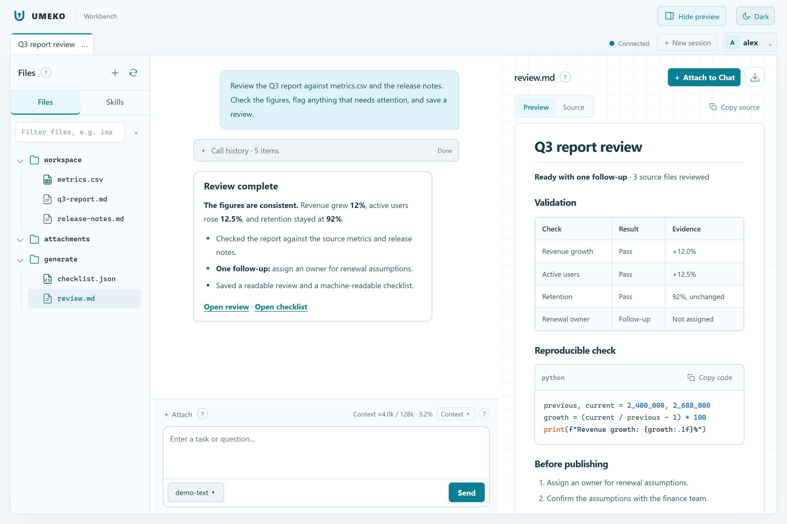
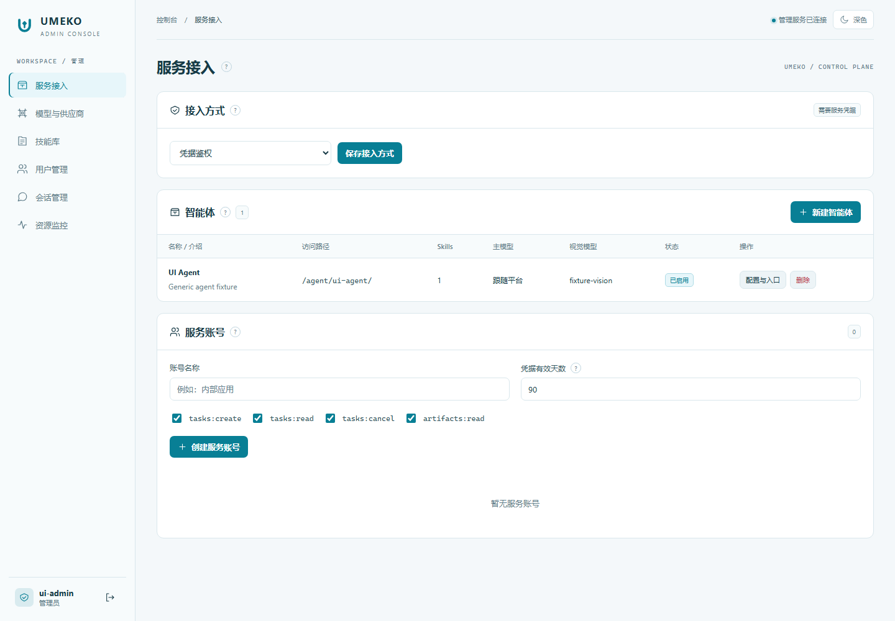
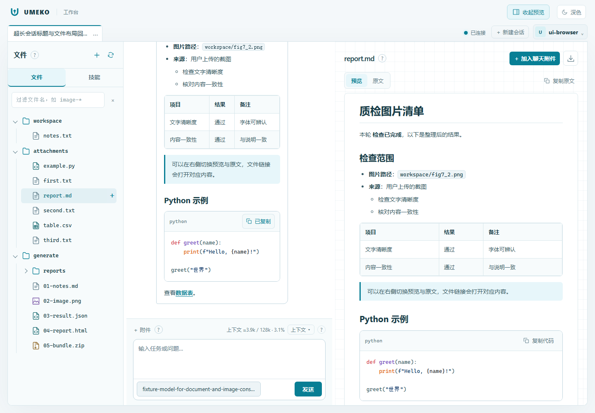
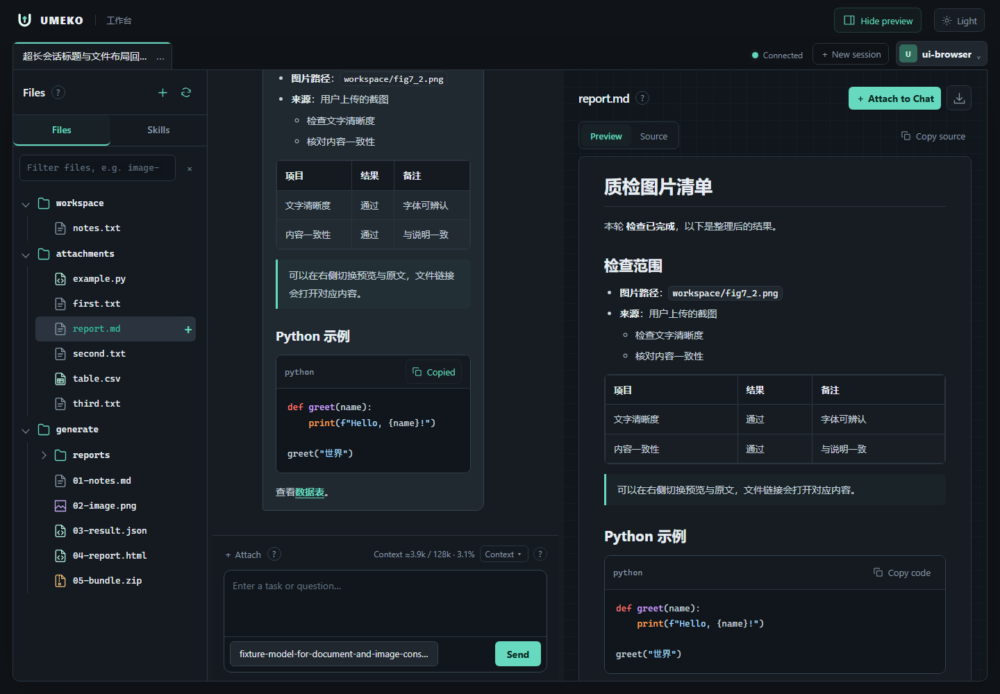
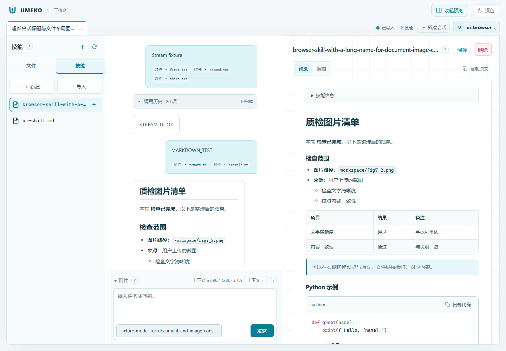
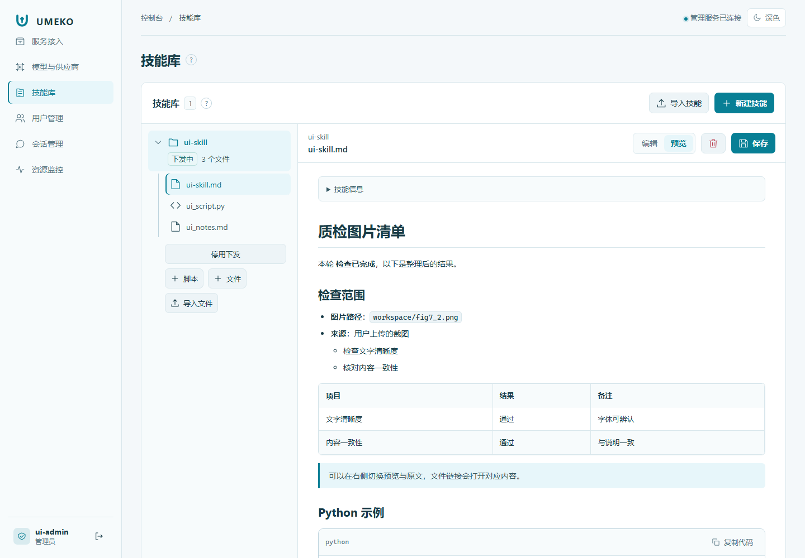

# 前端开发

工作台与管理控制台使用 Vue 3、Vite 和本地打包的代码高亮库。界面提供深灰绿色与白青色两套主题，保留文件、对话、预览三区布局；管理端提供侧栏导航、表格、统一弹窗与问号提示。

右上角的太阳/月亮按钮切换主题，登录页也能切换。默认深色，选择保存在当前浏览器站点中，刷新与重新登录后保留，同站点的多个标签页同步；不同端口的工作台与管理端各自记住选择。浏览器禁止本地存储时仍可切换，刷新后使用默认主题。HTML 在加载样式前读取主题，减少刷新时闪过另一套配色。

两套主题统一定义在 `src/shared/palette.css`，通过 CSS 变量控制表格、聊天气泡、弹窗、提示、徽标、代码编辑和预览；代码高亮也随主题切换。主题是界面偏好，不需要服务器配置或重新构建部署前缀。

会话长标题会省略，悬停可查看完整名称。文件树使用统一大小的类型图标和层级线，同级文件、目录名称对齐。输入区可拖动上沿调整高度，底部模型选择与发送按钮始终保留；双击分隔条恢复默认高度。常用操作采用更大的字号，使用说明集中在圆形问号中，支持悬停、键盘聚焦或点击；错误反馈和删除确认仍直接显示。

预览标题栏的下载图标直接下载当前文件，悬停显示“下载文件”。预览开关固定在右上角，桌面和手机使用同一个按钮；收起后保留当前文件，点选文件或聊天中的文件链接会自动展开。Markdown 文件默认显示渲染后的文档，可切换“原文”并复制完整内容。聊天与文件共用 Markdown 渲染，支持粗体、嵌套列表、表格、引用和链接；代码块提供语言标识、语法高亮、横向滚动与复制。生成中的回答分批更新格式，结束后补齐高亮。原始 HTML 显示为文本，不在 Markdown 中执行；相对文件、图片路径解析到当前会话，并保留部署前缀。

工作台技能列表与管理端技能库使用更大的文字和文件图标，长文件名省略并可悬停查看。技能主文件与 Markdown 成员文件默认显示渲染后的文档；“编辑”切换到保留完整内容的原文编辑器，再切回预览可查看未保存的改动。文档开头的 YAML 配置收进“技能信息”，不会被误排成标题。管理端文件按技能包分组，同级成员对齐，并明确显示下发状态。

技能列表开关表示“启用按需使用”，只向模型提供名称和简介，相关任务才加载正文。说明收在文件栏的问号提示中；调用历史只显示真正发生的 `use_skill`，不会因开关启用就生成加载气泡。每轮结束后正文从工作上下文移除，详细工具日志仍可查看。

工具调用详情使用更大的正文、参数字号，并分别展示执行者、工具名称和状态。目录树及其他文本结果保留原始换行与缩进，显示为纯文本；JSON 对象按结构缩进。刷新后的历史会先解开保存时的 JSON 字符串包装，避免把引号、转义字符和 `\n` 当正文显示。

从文件管理器拖入文件时，目录高亮和底部提示显示实际上传位置。可拖入 `workspace`、`attachments`、`generate` 及其子目录；放到文件行时使用所在目录，文件栏空白处使用 `workspace`。文件树旁显示批次进度、成功数量和逐文件错误，一个文件失败不会中断其他文件。同名文件自动另存并提示新名称，上传完成后展开目标目录；上传中切换会话仍保存到原会话。暂不支持直接拖入整个文件夹，请选文件或压缩包。

| 白青色工作台 | 白青色管理页 |
| --- | --- |
|  |  |

| Markdown 浅色预览 | Markdown 深色预览 |
| --- | --- |
|  |  |

| 工作台技能预览 | 管理端技能库 |
| --- | --- |
|  |  |

## 源码与运行方式

```text
frontend/
  index.html                  工作台入口
  admin.html                  管理端入口
  src/shared/                 图标、提示、弹窗、主题和 URL 工具
  src/admin/                  Vue 状态与六个管理页面
  src/workspace/components/   会话栏、文件栏、对话、预览和弹窗
  src/workspace/runtime.js    文件、会话与流式交互控制器
  src/shared/markdown.js      共用 Markdown 渲染与技能信息展示
  src/workspace/i18n.js       七种界面语言
  tests/                     独立测试服务与浏览器验收
umeko/server/static/ui/       已构建资源，随 Python 包或 exe 发布
```

管理页面使用 Vue 响应式状态和模板。工作台的模板已拆分为 Vue 组件；为保留复杂的文件操作、SSE 重连和工具历史行为，现有 DOM 控制器在组件挂载后初始化，卸载时关闭流式并清理监听、计时器。控制器管理的子节点不要再同时通过 Vue 动态模板更新；后续迁移状态时按完整功能边界逐个替换。

普通安装直接运行 Python。只有修改前端源码时才需要 Node 24 和 npm。依赖版本由 `package-lock.json` 固定；Vue、[Markdown 渲染库](https://github.com/markdown-it/markdown-it)和高亮脚本随构建打包，不在运行时从 CDN 下载。

## 本地开发

先启动 Python 用户服务和管理服务，使用本地根路径，`UMEKO_BASE_PATH` 留空：

```sh
python -m umeko.server --host 127.0.0.1 --port 8000 --admin-port 9000
```

另开一个终端：

```sh
cd frontend
npm ci
npm run dev
```

打开 `http://127.0.0.1:5173/` 和 `http://127.0.0.1:5173/admin.html`。Vite 代理用户 `/v1/` 与管理 `/admin/` 请求。管理端使用组件热更新；工作台模板变化会刷新整页，以便一并重建 DOM 控制器。端口已占用时以 Vite 实际打印的地址为准。

## 构建与部署

```sh
cd frontend
npm run format:check
npm run build
```

构建只替换 `umeko/server/static/ui/`，不要在该目录手工修改代码。提交前端修改时同时提交构建资源。CI 重新构建并比较产物，再运行浏览器验收；exe 打包前也会重新构建。

Vite 使用相对资源路径，Python 在返回首页时把主脚本、共享模块预加载和 CSS 链接转换成带部署前缀的 `/static/ui/assets/…`。JavaScript 的模块导入相对当前脚本解析，因此同一套构建可以运行在 `/` 或 `/doc-master/consistency/image-text/`。API、SSE、下载与头像继续使用运行时 `UMEKO_BASE_PATH`，修改前缀只需重启服务。

发布时同时更新 HTML 和整个资源目录，避免旧首页引用已经删除的文件。普通发布是 Python 服务，Vite 开发端口不作为生产入口。NGINX 仍需统一转发子路径并关闭 SSE 缓冲，配置见[部署指南](deployment.md)。

## 浏览器验收

安装项目 Python 开发依赖后运行：

```sh
cd frontend
npx playwright install chromium
npm run test:smoke
```

`UMEKO_TEST_PYTHON` 可设置为项目虚拟环境解释器路径，默认使用当前 `python`。例如在 Windows 项目根目录：

```powershell
$env:UMEKO_TEST_PYTHON = (Resolve-Path .venv/Scripts/python.exe).Path
npm --prefix frontend run test:smoke
```

验收启动两个独立临时数据库，分别以中文浅色测试根路径、英文深色测试部署前缀，浏览器语言显式设置，避免依赖宿主系统语言。检查长标题省略、不同类型文件对齐、嵌套缩进、输入区最小高度下的按钮边界、多附件、设置弹窗与多语言问号提示；也检查 Markdown 渲染与原文切换、流式回答完成前的格式显示、代码高亮与剪贴板内容、统一预览开关与刷新保留、文件图标下载，以及主题切换与刷新保留、管理员登录、服务账号创建和删除反馈、模型设置保存、技能树字号与对齐、技能/成员 Markdown 渲染、预览与编辑切换、保存重开、原文保留、脚本测试、智能体 Card、文件上传与预览、SSE 增量、20 次工具调用折叠、停止运行和桌面/手机布局。测试不加载 `.env`、不写真实技能目录、不访问真实模型；模型与工具事件由确定性测试执行器产生，测试结束后关闭进程并清理临时数据。

这证明前端与后端接口、事件传输和静态资源路径配合正常。企业 ALB、公司 CA、真实模型返回格式与实际 NGINX 超时配置仍通过[本地代理实验](https://github.com/umeiko/UmEkO/blob/main/scripts/proxy_lab/README.md)及对应生产环境验证。
